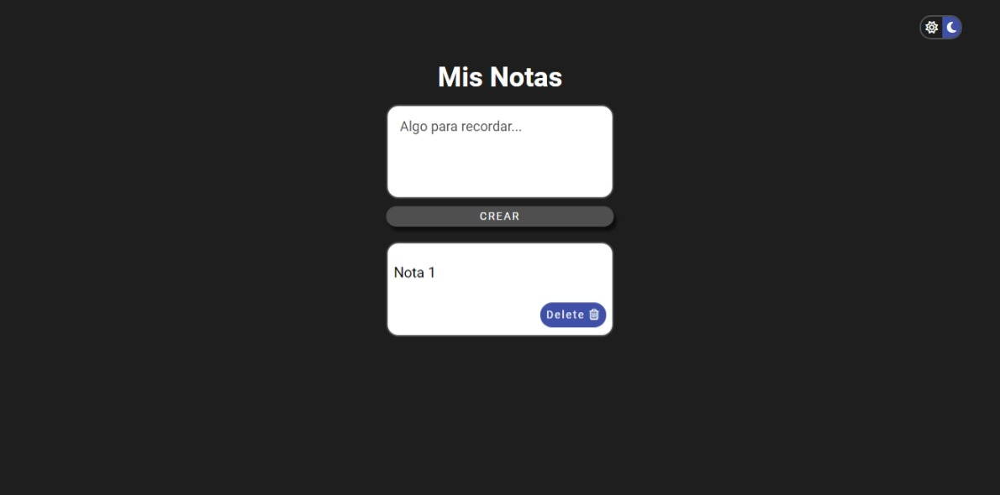

# App de Notas

## Tabla de contenidos

- [Overview](#overview)
  - [Challenge](#challenge)
  - [Screenshot](#screenshot)
  - [Links](#links)
- [Mi proceso](#mi-proceso)
  - [Herramientas](#herramientas)
  - [Aprendizaje](#aprendizaje)
  - [Oportunidades de mejora](#oportunidades-de-mejora)
- [Autor](#autor)

## Overview

### Challenge

Los usuarios serán capaces de:

- Agregar y borrar notas.
- Alternar entre el modo oscuro y claro.
- Guardado de notas y tema.

### Screenshot

### Links

- Live Site: [App Demo](https://lescano713.github.io/AppNotas/)

## Mi proceso

### Herramientas

- Semantic HTML5 markup
- CSS custom properties
- Flexbox
- Mobile-first workflow
- JavaScript

### Aprendizaje

En este proyecto, he tenido la oportunidad de profundizar mis conocimientos y habilidades en varios aspectos clave del desarrollo web y la programación. A continuación, describo algunas de las áreas principales en las que he trabajado y lo que he aprendido:

- Manipulación del DOM
Selección de elementos: Aprendí a utilizar métodos como getElementById y querySelector para seleccionar y manipular elementos del DOM, lo cual es esencial para interactuar con la estructura de la página web.

- Creación de elementos: Utilicé createElement y appendChild para crear y agregar nuevos elementos al DOM de manera dinámica, permitiendo la actualización de la interfaz del usuario en respuesta a sus acciones.

- Manejo de Eventos

Listeners de eventos: Añadí listeners a elementos para manejar las interacciones del usuario, como clics en botones, utilizando addEventListener.

Manejo de eventos: Implementé funciones para responder a eventos del usuario, como la creación y eliminación de tarjetas, mejorando la interactividad de la aplicación.

- Almacenamiento Local

Persistencia de datos: Utilicé localStorage para guardar datos entre recargas de página, asegurando que las notas y la preferencia de tema del usuario se mantengan.

JSON: Trabajé con JSON.stringify y JSON.parse para almacenar y recuperar objetos complejos en localStorage.

- Lógica Condicional
Alternancia de temas: Implementé lógica condicional para alternar entre temas oscuro y claro basándome en las preferencias del usuario almacenadas.

Gestión de estado: Utilicé declaraciones condicionales para gestionar el estado de tareas (completadas/incompletas), proporcionando una mejor experiencia de usuario.

- Gestión de Estado

Seguimiento de estado: Gestioné el estado de la aplicación utilizando variables para mantener el seguimiento de las notas y sus IDs.

Actualización del estado: Utilicé arrays y objetos para almacenar y actualizar el estado de las notas, asegurando que los cambios se reflejen correctamente en la interfaz del usuario.

- Generación de Contenido Dinámico

Contenido dinámico: Generé contenido dinámicamente basado en la entrada del usuario y en datos almacenados, permitiendo una actualización fluida y en tiempo real de la interfaz.

Actualización del DOM: Actualicé el DOM para reflejar los cambios en el estado de la aplicación, como la adición y eliminación de notas.

- Manipulación de Clases CSS

Clases CSS: Añadí y eliminé clases CSS para cambiar la apariencia de los elementos según su estado, como la alternancia entre el modo oscuro y claro.

- Validación de Datos

Validación de entrada: Implementé validación de la entrada del usuario para asegurar que los campos requeridos no estén vacíos antes de crear una nueva nota, mejorando la robustez de la aplicación.

### Oportunidades de mejora

A partir del código desarrollado, hay varias áreas en las que podría centrarme para mejorar y optimizar la aplicación:

- Mejora del Rendimiento
Minimización del Acceso al DOM: Acceder y manipular el DOM puede ser costoso en términos de rendimiento. Podría mejorar el rendimiento minimizando el número de accesos al DOM y utilizando fragmentos de documentos para realizar actualizaciones masivas de manera más eficiente.

- Gestión de Estados Complejos
Uso de una Biblioteca de Gestión de Estado: A medida que la aplicación crece en complejidad, gestionar el estado con variables simples y localStorage puede volverse difícil de mantener. Utilizar una biblioteca de gestión de estado como Redux podría simplificar el manejo de estados complejos y hacer el código más manejable y escalable.

- Mejoras en la UX/UI
Interfaz de Usuario más Intuitiva: Aunque la funcionalidad básica está implementada, la interfaz de usuario podría beneficiarse de mejoras adicionales para hacerla más intuitiva y atractiva. Esto podría incluir la adición de animaciones, transiciones suaves y mejoras en el diseño responsivo.

- Manejador de Errores
Implementación de Manejadores de Errores: Actualmente, no hay un manejo extensivo de errores. Implementar manejadores de errores robustos para capturar y gestionar errores de manera más efectiva mejoraría la resiliencia de la aplicación.

- Accesibilidad
Mejoras en la Accesibilidad: Asegurar que la aplicación sea accesible para todos los usuarios, incluidos aquellos con discapacidades, es crucial. Esto podría implicar la mejora del soporte para lectores de pantalla, la adición de etiquetas ARIA, y el aseguramiento de que la aplicación cumpla con las pautas de accesibilidad web.

- Código Modular
Modularización del Código: Dividir el código en módulos más pequeños y reutilizables podría mejorar la legibilidad y mantenibilidad del código. Esto incluye la separación de lógica de negocio, manipulación del DOM y estilos en archivos y funciones individuales.

## Autor

- Lindekin - [@DanaeLescano](https://www.twitter.com/yourusername)

